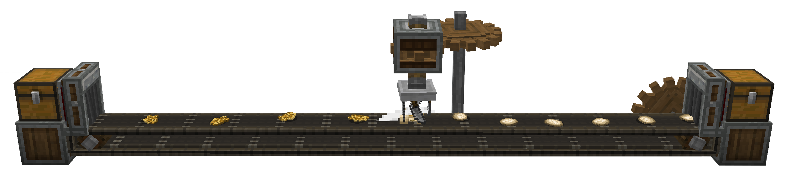
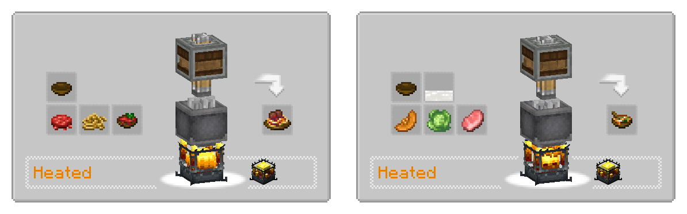
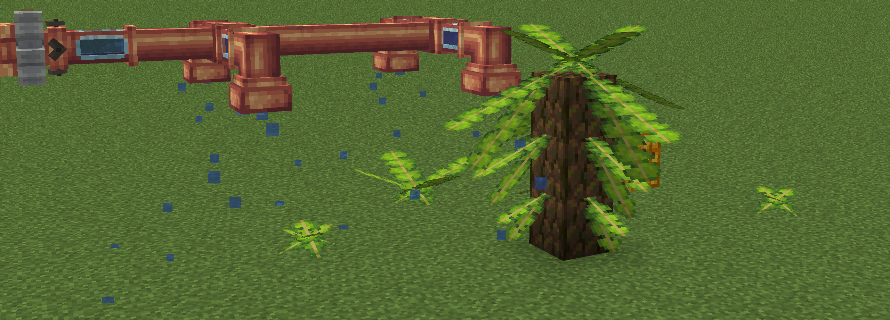
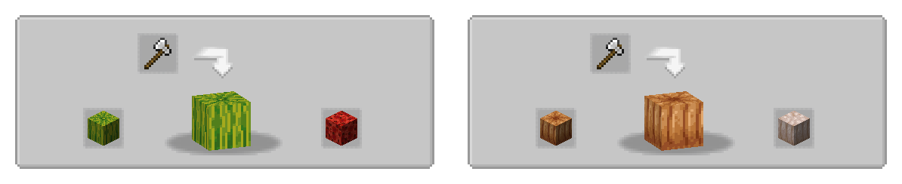

[KOTLIN_FORGE]: https://www.curseforge.com/minecraft/mc-mods/kotlin-for-forge
[KOTLIN_FABRIC]: https://www.curseforge.com/minecraft/mc-mods/fabric-language-kotlin
[CREATE_FORGE]: https://www.curseforge.com/minecraft/mc-mods/create
[CREATE_FABRIC]: https://www.curseforge.com/minecraft/mc-mods/create-fabric
[FARMERS_DELIGHT_FORGE]: https://www.curseforge.com/minecraft/mc-mods/farmers-delight
[FARMERS_DELIGHT_FABRIC]: https://www.curseforge.com/minecraft/mc-mods/farmers-delight-fabric
[OVERWEIGHT_FARMING]: https://www.curseforge.com/minecraft/mc-mods/overweight-farming
[NEAPOLITAN]: https://www.curseforge.com/minecraft/mc-mods/neapolitan
[DOWNLOAD]: https://www.curseforge.com/minecraft/mc-mods/slice-and-dice/files
[CURSEFORGE]: https://www.curseforge.com/minecraft/mc-mods/slice-and-dice
[MODRINTH]: https://modrinth.com/mod/slice-and-dice
[ISSUES]: https://github.com/PssbleTrngle/SliceAndDice/issues

<!-- modrinth_exclude.start -->

# Create Slice & Dice 

[][DOWNLOAD]
[][CURSEFORGE]
[][DOWNLOAD]
[][ISSUES]
[][MODRINTH]

<!-- modrinth_exclude.end -->

[][KOTLIN_FORGE]
[][KOTLIN_FORGE]
[][CREATE_FORGE]

[][KOTLIN_FABRIC]
[][KOTLIN_FABRIC]
[][CREATE_FABRIC]

### Slicer

This mod enables a variety of features to create better compatibility between mostly [Farmer's Delight][FARMERS_DELIGHT_FORGE] and [Create][CREATE_FORGE].
While it is designed to work with Farmer's Delight, it does work without it and also adds some compatibility features for other mods.



### Automatic Cutting

The Main feature of the mod is the _Slicer_, a machine similar to the _Mechanical Mixer_ or _Mechanical Press_ from Create.
It automatically registers all cutting recipes from Farmer's Delight. In that sense, it is an automatic _Cutting Board_.  
In order to use it, the correct tool has to be placed into the machine, using `Right-Click`.
By default, only knives and axes are allowed, but this behaviour can be overwritten by modifying the `sliceanddice:allowed_tools` item tag.
An example datapack which adds shears to this tag can be found [here](example_datapack.zip)

### Automatic Cooking

All recipes from Farmer's delight requiring the Cooking Pot are added as heated mixing recipes.



### Sprinkler

The Sprinkler is a block which, when provided with a fluid using a pipe, will distribute it in a small area below.  
Different fluids can have different effects.

- Lava applies a small amount of fire damage to entities below
- Water makes the area below wet, making the world think it's raining there.
- Potions apply their affect for a short duration to entities below
- Liquid Fertilizer, a new fluid, applies a bonemeal affect to blocks.

The latter is meant to enable growing of _Banana Fonds_ from [Neapolitan][NEAPOLITAN] without being dependent on the weather, but it could possibly have other effects on other mods too.

Sprinklers work on contraptions and apply there effect every time they are moved to a new block.
The also work in physics contraptions created by [Create Simulated](https://createsimulated.com/).



### Overweight Farming

If present, some compatibility features for [Overweight Farming][OVERWEIGHT_FARMING] is added.  
This includes waxing recipes using the deployer,
as well as showing the axe-stripping of overweight crops in JEI.




### Custom Recipes

If you want to add custom recipes using a datapack, this can also be done and
works for both single recipes and steps of a sequences assembly recipe.
Examples for these can be found in the [example datapack](example_datapack.zip).

### Custom Sprinkler Actions

What effect which fluid in the sprinkler has is data-driven an can be modified or extended.
You can find the build-in actions [here](neoforge/src/generated/resources/data/sliceanddice/sliceanddice/sprinkler).

<details>
    <summary>shape of a sprinkler JSON file</summary>
    
    ```json
    {
      "action": {
         // the action that will be executed. custom actions can be registered to the `sliceanddice:sprinkle_action` registry.
        "type": "sliceanddice:damage",
        // some parameters, depending on what action type has been set above
        "amount": 0.5,
        "damage_type": "minecraft:in_fire"
      },
      "fluid": {
        "fluid": "minecraft:lava"
      }
    }
    ```
</details>

### For Developers

When depending on the mod, you can include it from my maven, which will have the benefit of including transient dependencies.
There is also an `api` package, which should be enought at compile time for some use-cases,
for example when only adding a custom sprinkler or sprinkle action.

When a new release is already being worked on, there might also be `-SNAPSHOT` versions being published, which you can use to already get a look at upcoming changes.


```kotlin
repositories {
    maven {
        url = uri("https://registry.somethingcatchy.net/repository/maven-public/")
        content {
            includeGroup("com.possible-triangle")
        }
    }
}

dependencies {
    compileOnly("com.possible-triangle:sliceanddice-api:$sd_version")
    runtimeOnly("com.possible-triangle:sliceanddice-neoforge:$sd_version")
}
```

Under the hood, slice & dice uses the library [atmosphere](https://github.com/PssbleTrngle/Atmosphere), which itself is still early in development.
